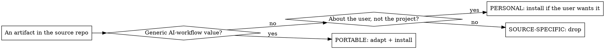

# Porting AI docs between repos

## Overview

A mature repo accumulates AI-workflow infrastructure: `CLAUDE.md` rules, `.adn/`-style docs, Claude Code skills, hooks, sub-agent definitions, and settings. Most of that is project-specific, but a portable core (generic skills, context-automation hooks, writing-style rules, documentation discipline) is worth carrying into other repos.

Porting is NOT copy-paste. It is **classify, then adapt**. Every artifact is one of three kinds, and each kind is handled differently. The target keeps its own identity: you AUGMENT the target, you never clobber its existing docs.

For SSH Lite specifically, the concrete source is `D:\CT\Repos\3in1` and the full decision list already lives in `references/catalog.md`. Read that to re-run or extend the port; read this file for the method.

## When to use

- Bringing skills / hooks / rules from a richer repo (here: 3in1) into this one.
- Re-syncing after the source repo gained new infra worth having here.
- Adding context-automation hooks or writing-style skills that another repo already proved out.

Do NOT use this to copy a source repo's project-specific rules verbatim (its database access rules, ticket conventions, build steps, reviewer gates). Those are exactly what the classify step drops.

## The method

1. **Inventory the source.** List `<source>/.claude/skills`, `.claude/agents`, `.claude/hooks` (and `lib/`), `.claude/settings.json`, `.claude/critical-rules.md`, `CLAUDE.md`, `lessons.md`, `reference/`, templates. The exploration is fan-out work - dispatch sub-agents to read and summarize rather than reading everything in the main context.

2. **Classify each artifact** as PORTABLE, PERSONAL, or SOURCE-SPECIFIC (flowchart above). PORTABLE = generic AI-workflow value (context-automation hooks, documentation-discipline skills). PERSONAL = about the user not the project (writing-style preferences, keyboard quirks). SOURCE-SPECIFIC = tied to the source's domain (its database, its ticket system, its build, its reviewers) - drop these.

3. **Adapt every artifact you keep** (see "Adaptation rules" below). Never install a source file unchanged if it names the source's paths, domain, or rules.

4. **Install + relax + verify.** Place adapted skills under `.claude/skills/`, hooks under `.claude/hooks/`, wire hooks into `.claude/settings.json`. Apply the target's relaxation policy (`references/relaxation-policy.md`): downgrade strict enforcement that does not fit the target (per-action approval gates, mandatory multi-file read gates, "restart from root" language) to guidance. Then verify: JSON valid, each hook runs on sample stdin, skills are discovered.

## Adaptation rules (apply to every kept artifact)

1. Rewrite the hardcoded fallback path (`<source-root>`) to the target root.
2. Repoint source paths to target equivalents: the source's `lessons.md` -> the target's lessons file; the source's working-folder convention -> the target's structure; `CLAUDE.md` section names -> the target's section names.
3. Replace any injected "project context" block (stack, domain, conventions) with the target's.
4. Strip the source's domain strings from all skill bodies and hook output: person names, ticket IDs, tool names, database names, file-type specifics. Keep the principle, drop the examples.
5. Point documentation-discipline skills (`auto-document-reusable`, `auto-gotcha`) at the target's lessons + CLAUDE.md locations.
6. Repoint any `critical-rules.md` reference to a target-appropriate slim rules file (distilled from the target's own rules, not the source's).

## Augment, never clobber

The target repo has its own `CLAUDE.md`, `.adn/`, and lessons. Porting ADDS infrastructure (skills, hooks, a slim rules file); it does not overwrite the target's existing content. If a ported skill overlaps an existing target rule, make the skill reinforce that rule (cross-reference it), do not duplicate or contradict it.

## Quick reference

| Artifact kind | Examples | Action |
|---|---|---|
| Context-automation hooks | prompt-context-injector, pre/post-compact, subagent-rules-inject | PORTABLE - adapt paths + injected context |
| Documentation-discipline skills | auto-document-reusable, auto-gotcha | PORTABLE - repoint to target docs |
| Writing-style skills | no-em-dash, no-shorthand, short-simple-answers | PERSONAL - install if the user wants |
| Enforcement hooks tied to source domain | db-readonly, git-deny, mcp-restricted, logwork | SOURCE-SPECIFIC - drop |
| Domain skills / agents | database probers, release-script reviewers, SQL/DDL skills | SOURCE-SPECIFIC - drop |
| The source's full rules file | critical-rules.md | Do not copy - write a slim target version |

## Common mistakes

- Copying a hook unchanged so its fallback path or injected context still names the source repo.
- Carrying the source's strict enforcement into a solo target (per-action git approval, restart-from-root). Relax it - see `references/relaxation-policy.md`.
- Overwriting the target's `CLAUDE.md` / `.adn/` instead of adding alongside.
- Forgetting that injectors read the target's lessons format. Check the lesson-entry delimiter (e.g. `## ` date headers vs `- **` bullets) and fix the split regex, or keyword matching silently returns nothing.
- Leaving runtime artifacts (`_session_state.json`, `_context_checkpoint.md`, `.claude_hook_report/`) untracked-but-not-ignored. Add them to `.gitignore`.

## Validate the port

Lightweight application test (this is a technique skill, not a discipline gate): after installing, run each hook on a sample payload and confirm output references the target, not the source; confirm the JSON parses; confirm the new skills appear next session. The detailed checklist is in `references/catalog.md` under "Verification".
