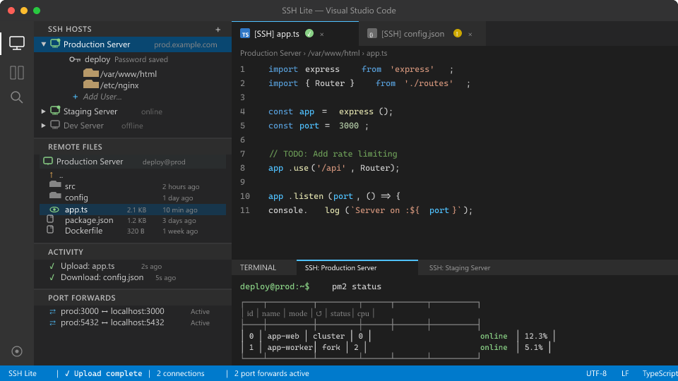
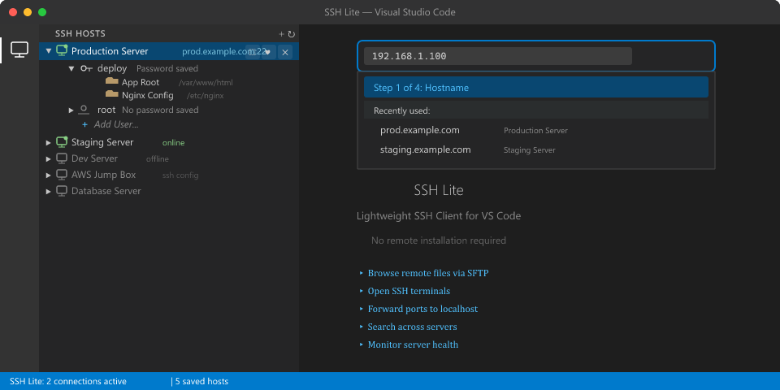
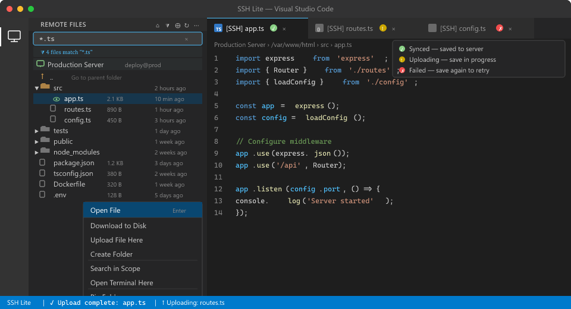
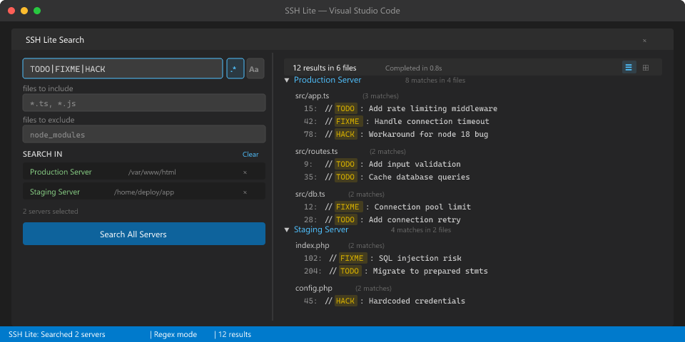
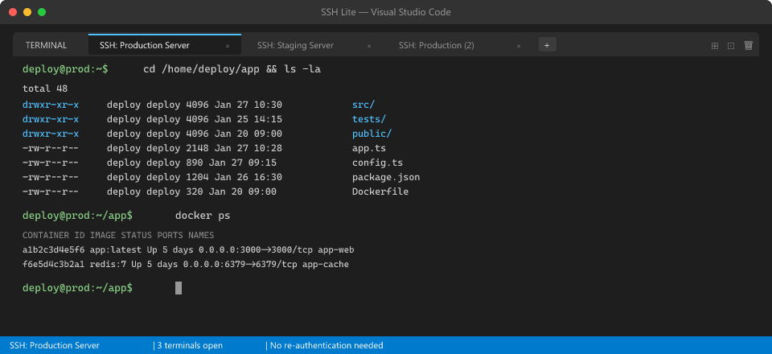
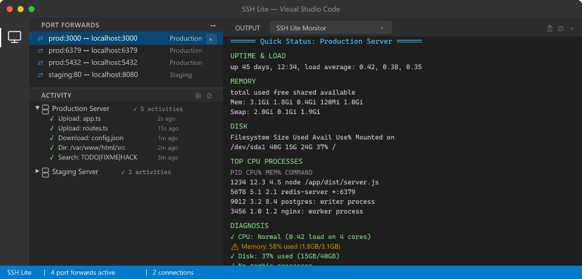

# SSH Lite - Lightweight SSH Client for VS Code


> **BETA VERSION** - This extension is in active development. Please report any issues on [GitHub](https://github.com/trantung95/SSHLite/issues).

**The ultimate lightweight SSH extension for Visual Studio Code!** Connect to remote servers, browse files, open terminals, and forward ports - all **without installing anything on the remote server**. Perfect for small VMs, shared hosting, and resource-constrained environments.



## Why SSH Lite?

Unlike VS Code's official Remote-SSH extension that installs a heavy VS Code Server on your remote machine (consuming RAM, CPU, and disk space), **SSH Lite works entirely from your local VS Code**. No remote installation required!

| Feature | SSH Lite | Remote-SSH |
|---------|----------|------------|
| Remote server installation | **None** | ~200MB+ |
| Works on shared hosting | **Yes** | No |
| Works on tiny VMs (512MB RAM) | **Yes** | Often fails |
| Multiple simultaneous connections | **Yes** | Limited |
| Server resource usage | **Zero** | High |

## Features

### Connect & Manage Hosts
Manage multiple SSH servers from the sidebar. Auto-detect SSH keys, save passwords, pin folders, and connect with one click. Reads `~/.ssh/config` automatically.



### Remote File Browser
Browse, edit, upload, and download files via SFTP. Upload state badges on editor tabs show sync status (✓ synced, ↑ uploading, ✗ failed). Filter files, right-click for full context menu.



### Search Across Servers
Search files across multiple remote servers simultaneously with regex support. Include/exclude patterns, scoped search, and results grouped by server.



### Integrated SSH Terminals
Open multiple SSH terminals per connection — no re-authentication needed. Full terminal emulation with VS Code integration.



### Port Forwarding & Server Monitor
Forward remote ports to localhost. Monitor server health with CPU, memory, disk, top processes, and diagnostics — all from the Output panel.



### All Features

**Core**
- Remote File Browser — Browse, edit, upload, download files via SFTP
- Integrated Terminal — Multiple SSH terminals per connection
- Port Forwarding — Forward local ports to remote services
- File Transfer — Upload/download files and folders

**Smart**
- Auto-Save Credentials — Enter password once, auto-saved for next time
- SSH Config Support — Reads from `~/.ssh/config` automatically
- Multiple Connections — Connect to multiple servers simultaneously
- Auto-Reconnect — Automatic reconnection on unexpected disconnect
- Live File Refresh — Auto-refresh opened files from remote server
- Upload State Badges — Tab badge shows upload progress (↑) and failures (✗)
- File Search — Search across remote files with webview panel
- Filename Filter — Filter file tree with highlighting
- Activity Panel — Track all file operations in real-time
- Server Monitoring — Quick status, diagnose slowness, check services
- Large File Handling — Smart handling for files >100MB

**Simple & Fast**
- One-click connect — Just click a host to connect
- No configuration needed — Works out of the box
- Minimal prompts — Credentials auto-saved, no extra questions

## Quick Start

### 1. Install Extension
Search "SSH Lite" in VS Code Extensions or install from command line:
```bash
code --install-extension hybr8.ssh-lite
```

### 2. Add a Host
- Click the **+** icon in SSH Lite sidebar
- Enter hostname, username, port
- Done!

### 3. Connect
- Click any host to connect
- Enter password (saved automatically for next time)
- Browse files, open terminals, forward ports

## Usage

### Connect to Server
1. Open SSH Lite in the Activity Bar (sidebar)
2. Click on any host to connect
3. First time: enter password → auto-saved for next time
4. Next time: instant connection!

### Browse & Edit Files
- Click on "Remote Files" panel after connecting
- Double-click files to open and edit
- Changes auto-upload on save
- Right-click for download, upload, delete options

### Open Terminal
- Right-click connected host → "Open Terminal"
- Or click the terminal icon on connected hosts
- Open multiple terminals on same connection (no re-auth!)

### Port Forwarding
- Open "Port Forwards" panel
- Click **+** to add new forward
- Enter local port, remote host, remote port
- Access remote services on localhost!

### Monitor Server
- Right-click connected host → Monitor icon
- **Quick Status** - CPU, memory, disk, top processes
- **Diagnose Slowness** - Find why server is slow
- **Watch** - Real-time monitoring
- **Check Services** - View service status
- **Recent Logs** - View system logs

## Configuration

All settings are in VS Code Settings under "SSH Lite":

| Setting | Default | Description |
|---------|---------|-------------|
| `sshLite.hosts` | `[]` | Saved SSH hosts |
| `sshLite.sshConfigPath` | `""` | Custom SSH config path |
| `sshLite.defaultRemotePath` | `~` | Default path when connecting |
| `sshLite.autoUploadOnSave` | `true` | Auto-upload files on save |
| `sshLite.connectionTimeout` | `10000` | Connection timeout (ms) |
| `sshLite.keepaliveInterval` | `30000` | Keepalive interval (ms) |
| `sshLite.treeRefreshIntervalSeconds` | `0` | Auto-refresh file tree (0=disabled) |
| `sshLite.fileRefreshIntervalSeconds` | `0` | Auto-refresh opened files (0=disabled) |
| `sshLite.largeFileSizeThreshold` | `104857600` | Large file threshold (100MB) |

## Commands

| Command | Description |
|---------|-------------|
| `SSH Lite: Connect to Host` | Connect to an SSH host |
| `SSH Lite: Add SSH Host` | Add a new host |
| `SSH Lite: Open Terminal` | Open SSH terminal |
| `SSH Lite: Forward Port` | Create port forward |
| `SSH Lite: Monitor Server` | Server monitoring tools |
| `SSH Lite: Quick Status` | Quick server status |
| `SSH Lite: Diagnose Slowness` | Diagnose slow server |
| `SSH Lite: Show Audit Log` | View file operation logs |

## Requirements

- **VS Code** 1.85.0 or higher
- **SSH access** to your remote server (password or SSH key)
- No remote server requirements!

## Supported Authentication

- SSH Keys (RSA, Ed25519, ECDSA)
- Encrypted SSH keys (with passphrase)
- SSH Agent
- Password authentication
- SSH config file (`~/.ssh/config`)

## Troubleshooting

### Connection Timeout
- Increase `sshLite.connectionTimeout` in settings
- Check firewall allows SSH (port 22)

### Authentication Failed
- Verify username and password/key
- Clear saved credentials: Right-click host → "Clear Saved Credentials"
- Check SSH key permissions (should be 600)

### File Operations Slow
- Normal for large files over slow networks
- Use "Download to disk" option for very large files

## Known Issues

None at this time. Please report issues on GitHub.

## Contributing

Contributions welcome! Please submit Pull Requests on GitHub.

## License

Apache-2.0 License

## Release Notes

### 0.2.1 (Beta)
- **Comprehensive regression test suite** - 727 tests (30 suites) covering all features
- **Extracted extension helpers** - `parseHostInfoFromPath`, `isInSshTempDir`, `hasSshPrefix` as testable exports
- **Real API upload state tests** - Tests actual FileService `isFileUploading`/`isFileUploadFailed` public methods
- **Progressive download tests** - Full coverage for ProgressiveDownloadManager (threshold, state, cancel, cleanup)
- **Binary file detection tests** - `isLikelyBinary`, `parsePreviewUri`, `createPreviewUri` coverage
- **WriteFile timeout pattern tests** - Settled guard, double-settle prevention, callback race conditions
- **Drag-and-drop connection reorder** - Tests for sidebar connection drag/drop reorder algorithm
- **Orphaned file detection tests** - Tests real helper functions for startup SSH file detection

### 0.2.0 (Beta)
- **Upload state tracking** - Tab badges show upload progress (↑ yellow) and failures (✗ red) via FileDecorationProvider
- **Reliable file save** - Replaced SFTP stream with writeFile API for confirmed server-side writes (no more false failures)
- **Cross-platform path normalization** - Fixed Windows drive letter case mismatch between VS Code and OS APIs
- **Save notification fix** - Status bar correctly shows upload result instead of spinner
- **Activity panel** - Real-time tracking of all SSH operations
- **Multi-server grouping** - Hosts grouped by host:port in sidebar
- **Search auto-cancel** - Previous search cancelled when starting new one
- **Comprehensive test suite** - 674 tests (587 mock + 87 Docker e2e)

### 0.1.9 (Beta)
- Fix disconnect auto-reconnect behavior
- Fix sidebar icon issues
- Security hardening and LITE principles compliance

### 0.1.8 (Beta)
- Add Banh Mi Easter egg

### 0.1.7 (Beta)
- Auto-reconnect on unexpected connection drop
- Live file tracking and auto-refresh
- UX improvements

### 0.1.6 (Beta)
- Fix marketplace packaging issues

### 0.1.5 (Beta)
- Fix extension activation issue (commands not found)
- Fix view registration mismatch
- Include node_modules dependencies in VSIX
- Proper terminal icon for marketplace
- Allow password retry on authentication failure

### 0.1.2 (Beta)
- Search feature redesign with webview panel
- Filename filter with tree highlighting
- Smart refresh and real-time file watching
- Progressive download for large files
- UX enhancements: auto-dismiss notifications, keyboard shortcuts
- Improved preloading and caching

### 0.1.0
- Initial release
- Remote file browser with SFTP
- Integrated SSH terminals
- Port forwarding
- Auto-save credentials
- Server monitoring tools
- Audit trail logging
- Large file handling

---

## Keywords

ssh, sftp, remote, terminal, ssh client, remote file, file browser, ssh terminal, port forwarding, ssh tunnel, remote development, remote server, linux server, vps, virtual server, cloud server, aws ssh, azure ssh, gcp ssh, digitalocean, linode, vultr, ssh connection, ssh key, ssh password, ssh config, putty alternative, remote access, server management, devops, sysadmin, system administration, remote file editing, remote file browser, ssh file transfer, secure shell, openssh, remote terminal, ssh extension, vscode ssh, vs code ssh, visual studio code ssh, lightweight ssh, simple ssh, easy ssh, fast ssh, no install ssh, serverless ssh, agentless ssh, remote coding, remote editing, server monitoring, linux monitoring, server status, server diagnostics

---

**Enjoy simple, fast SSH access!**

---

<div align="center">

### 🥖 Send me a Bánh Mì

<sub>If this extension saved you time, you could send me a Vietnamese sandwich! 🇻🇳</sub>

**Crypto wallet**: *Coming soon* ☕

<sub>🪷 Made with cà phê sữa đá in Vietnam 🍜</sub>

</div>
