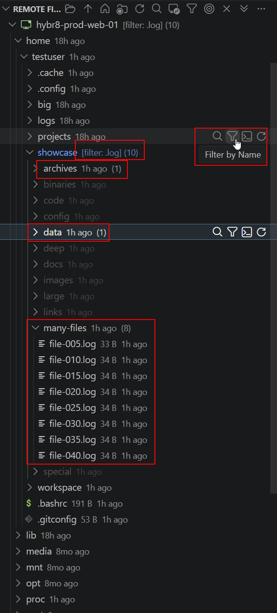
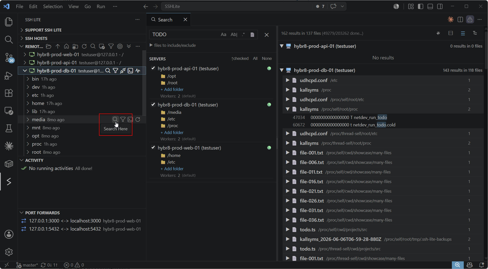
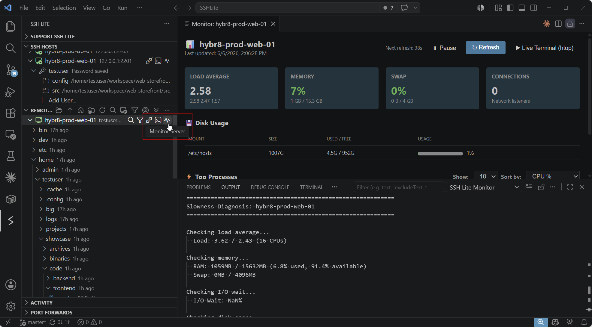
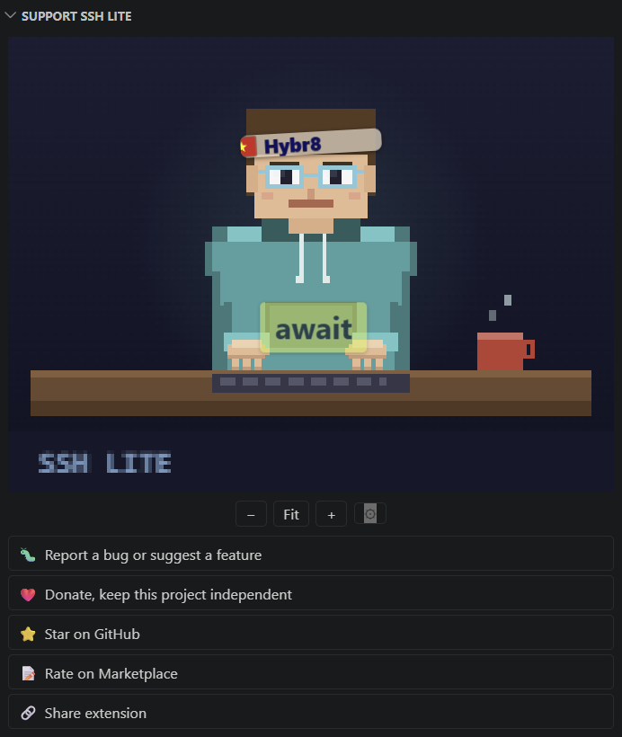
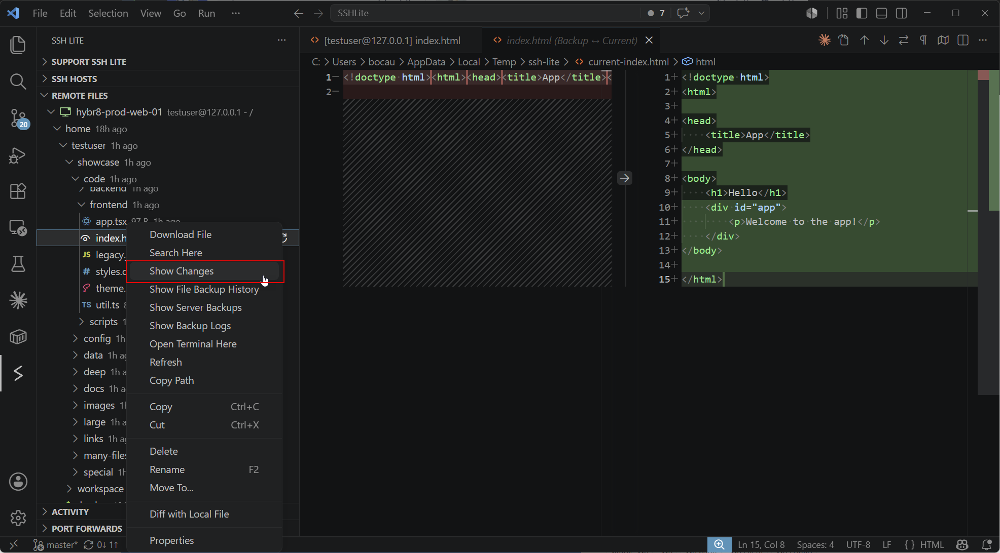

# SSH Lite (SSH Tools) — Lightweight SSH Suite for VS Code

> Active development. Please report issues on [GitHub](https://github.com/trantung95/SSHLite/issues).

**A visual SSH client for VS Code.** Browse files, edit in your editor, manage services, view processes, edit cron, forward ports — **by clicking, not by typing `vi` / `systemctl` / `crontab -e` / `ps aux | grep`**. Runs entirely over plain SSH/SFTP with **nothing installed on the remote server**. Perfect for VPS, small VMs, shared hosting, and resource-constrained Linux boxes.

## Why SSH Lite?

Three ways to drive a Linux box from VS Code — pick the one that fits your VPS.

| | SSH Lite | Raw SSH (terminal + vi) | Remote-SSH |
|---|---|---|---|
| Interaction | **Visual** — click to browse, edit, monitor | Type every command | Full IDE feel |
| Remote install | **None** | None | ~200MB+ |
| Edit files | In VS Code | `vi` / `nano` | In VS Code |
| Terminal at any folder | **1-click** — then do whatever in raw shell | login, then `cd /path/...` | open terminal + `cd` |
| Tiny VMs (512MB RAM) | ✓ | ✓ | Often fails |
| Multiple connections | ✓ many in one window | Multiple terminals | 1 per window |
| Server resource usage | **Zero** | Zero | High |

SSH Lite sits in the middle: as light as raw SSH, as friendly as Remote-SSH.

## Features

📖 **[Full feature reference →](https://github.com/trantung95/SSHLite/blob/master/docs/FEATURES.md)** - every feature, with what you click vs. what you would otherwise type. Highlights:

<table>
<tr>
<td rowspan="2" align="center" valign="top">
 
<b><a href="https://github.com/trantung95/SSHLite/blob/master/docs/FEATURES.md#filter-by-name">Filter files/folders</a></b> gray out non-matches, no <code>find . -name</code>
</td>
<td align="center" valign="top">
 
<b><a href="https://github.com/trantung95/SSHLite/blob/master/docs/FEATURES.md#multi-server-search">Multi-server search</a></b> one webview, not per-host <code>grep -r</code>
</td>
</tr>
<tr>
<td align="center" valign="top">
 
<b><a href="https://github.com/trantung95/SSHLite/blob/master/docs/FEATURES.md#server-monitor">Server monitor</a></b> CPU / memory / disk + top processes
</td>
</tr>
<tr>
<td align="center" valign="top">
 
<b><a href="https://github.com/trantung95/SSHLite/blob/master/docs/FEATURES.md#animated-coder-and-cheering-banner">The pixel coder</a></b> reacts to your typing and your AI
</td>
<td align="center" valign="top">
 
<b><a href="https://github.com/trantung95/SSHLite/blob/master/docs/FEATURES.md#remote-diff">Side-by-side diff of changes</a></b> review edits, no <code>scp</code> then <code>diff</code>
</td>
</tr>
</table>

**Also:** [file browser](https://github.com/trantung95/SSHLite/blob/master/docs/FEATURES.md#browse-and-edit-over-sftp) · [terminals](https://github.com/trantung95/SSHLite/blob/master/docs/FEATURES.md#integrated-terminals) · [cron editor](https://github.com/trantung95/SSHLite/blob/master/docs/FEATURES.md#cron-editor) · [port forwarding](https://github.com/trantung95/SSHLite/blob/master/docs/FEATURES.md#set-up-a-port-forward) · [process viewer](https://github.com/trantung95/SSHLite/blob/master/docs/FEATURES.md#process-viewer) · [service manager](https://github.com/trantung95/SSHLite/blob/master/docs/FEATURES.md#service-manager) · [env inspector](https://github.com/trantung95/SSHLite/blob/master/docs/FEATURES.md#environment-inspector) · [snippets](https://github.com/trantung95/SSHLite/blob/master/docs/FEATURES.md#snippet-library) · [batch runner](https://github.com/trantung95/SSHLite/blob/master/docs/FEATURES.md#batch-command-runner) · [key gen + push](https://github.com/trantung95/SSHLite/blob/master/docs/FEATURES.md#ssh-key-generator-and-push) · [auto-backup + restore](https://github.com/trantung95/SSHLite/blob/master/docs/FEATURES.md#auto-backup-and-restore) · [sudo fallback](https://github.com/trantung95/SSHLite/blob/master/docs/FEATURES.md#sudo-fallback) · [copy / paste across hosts](https://github.com/trantung95/SSHLite/blob/master/docs/FEATURES.md#copy-cut-and-paste-across-hosts) · [activity + audit](https://github.com/trantung95/SSHLite/blob/master/docs/FEATURES.md#activity-panel) · [pinned folders](https://github.com/trantung95/SSHLite/blob/master/docs/FEATURES.md#pinned-and-recent-folders)

## Quick Start

1. Install — search "SSH Lite" in Extensions, or `code --install-extension hybr8.ssh-lite`
2. Click **+** in the SSH Lite sidebar, add a host
3. Click the host to connect — credentials are saved automatically

Reads `~/.ssh/config`. Supports SSH keys (RSA / Ed25519 / ECDSA, encrypted), agent, and password.

**117 commands** — full reference at [docs/COMMANDS.md](https://github.com/trantung95/SSHLite/blob/master/docs/COMMANDS.md).

## Remote-SSH compatibility

SSH Lite prefers to run on **your local machine** — Windows, macOS, or Linux — even when VS Code is connected to a remote workspace via the built-in Remote-SSH extension. When you install SSH Lite from the Marketplace inside a Remote-SSH session, you will see the **Install in Local** button on the extension page — click it. SSH Lite then connects to remote servers directly from your local machine and downloads files to your local home directory:

- **Windows**: `C:\Users\<you>\...`
- **macOS**: `/Users/<you>/...`
- **Linux**: `/home/<you>/...`

Side-by-side use works without surprises: keep your Remote-SSH editing session on remote server **A**, and use SSH Lite to browse, download from, terminal into, and port-forward from any number of other servers **B**, **C**, **D** — all from your own machine. File browsing, editing, terminals, port forwards, search, snippets, cron, diffs, and the rest of the SSH Tools suite all operate over SSH Lite's own SSH/SFTP connections, independent of where the VS Code workspace lives or which OS you run VS Code on.

Two edge cases worth knowing:

- **Port forwards bind to your local machine.** A process running inside the Remote-SSH workspace (e.g. `curl` in the Remote-SSH terminal) cannot reach the forwarded port. Use VS Code's built-in Remote-SSH port forwarding for that direction.
- **Chained SSH (rare).** If you specifically want to run SSH Lite *from* the remote server to a third server, install SSH Lite on the workspace host as well. SSH Lite will detect this and show a one-time hint pointing you back to Install in Local; dismiss it with the `sshLite.suppressLocalInstallHint` setting.

## Release Notes

**1.0.1** - FTP fixes from the first user reports. **Copy and paste files on the same FTP server** now works (issue #14) - SSH Lite downloads and re-uploads the file for you, since FTP has no server-side copy; copy/cut/paste are also now available from the FTP right-click menu. **File dates over FTP are correct** again instead of all showing "56 years ago" (issue #15) - older FTP servers report dates in a text format SSH Lite now parses. The **Expand All** button no longer errors on VS Code versions before 1.94 (issue #16). Also hardens FTP-only edge cases: Save as Root and removing/renaming an FTP host on the default port 21 no longer misbehave.

**1.0.0** - First stable release. **Connect to FTP and FTPS servers** (issue #9): add a host, pick **FTP / FTPS**, and browse, edit, upload, download, rename, delete, and create files and folders with the same clicks you already use for SSH, with no terminal, no separate FTP client, and nothing installed on the server. Supports plain FTP, encrypted **FTPS** (TLS), and **anonymous** login. Because FTP has no shell, the shell-only features (terminal, cross-server search, server monitor, system tools, sudo, port forwarding) are hidden for FTP connections so the menus only show what actually works. Built on the pure-JavaScript `basic-ftp` library. The hosts view also gains a **SSH / FTP grouped tree** with a one-click List/Tree toggle. Existing SSH connections, saved hosts, settings, and keybindings are unchanged - no migration needed.

[Full changelog](https://github.com/trantung95/SSHLite/blob/master/.adn/CHANGELOG.md)

## License

Apache-2.0

---

### 🥖 Send me a Bánh Mì

#### If this extension saved you time, you could send me a Vietnamese sandwich! 🇻🇳

Scan the QR for whichever coin you want to send:

<table width="100%">
<tr>
<td align="center" valign="top" width="280">
   
  send <b>SOL · USDT · USDC</b> — via Solana chain 
  <small>(any SPL token accepted)</small> 
  <code>GURgJGXeFfbV9S4Kr1xgxCrS367w3gkCuuS8up7xiDEG</code>
</td>
<td>&nbsp;</td>
<td align="center" valign="top" width="280">
   
  send <b>TON · USDT</b> — via The Open Network chain 
  <small>(any Jetton accepted)</small> 
  <nobr><code>UQBbblS1-F3ufPBPD13EKfp28G_A_j10kXNn-XuuxQUwoIEs</code></nobr>
</td>
</tr>
</table>

💡 No memo / tag required for either chain — just send the coin to the address.

⚠️ Send only the matching coin on its matching chain — wrong coin / wrong chain = lost funds

#### ☕ Made with cà phê sữa đá in Vietnam 🍜

