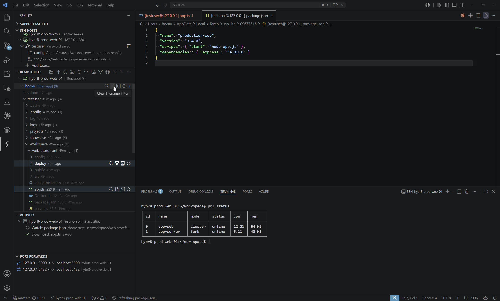
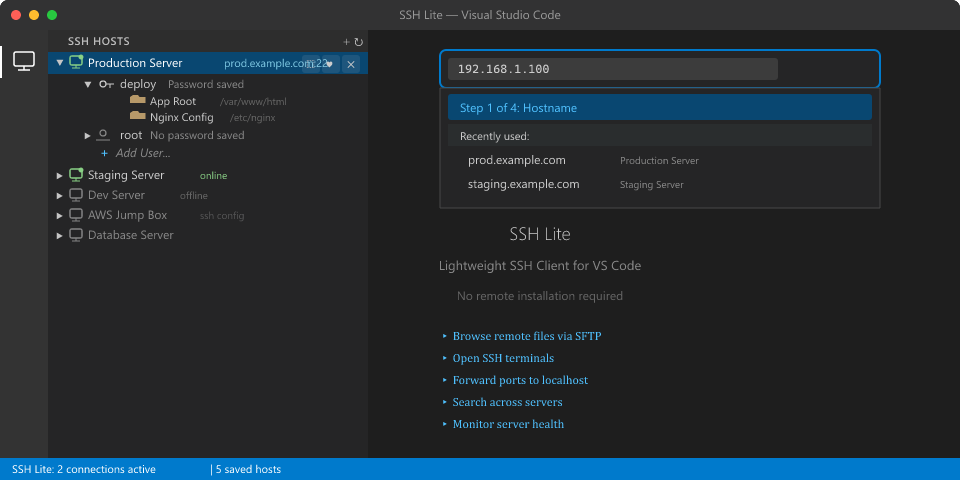
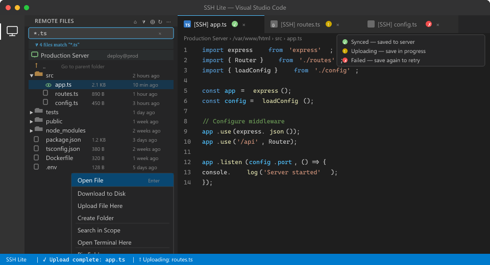
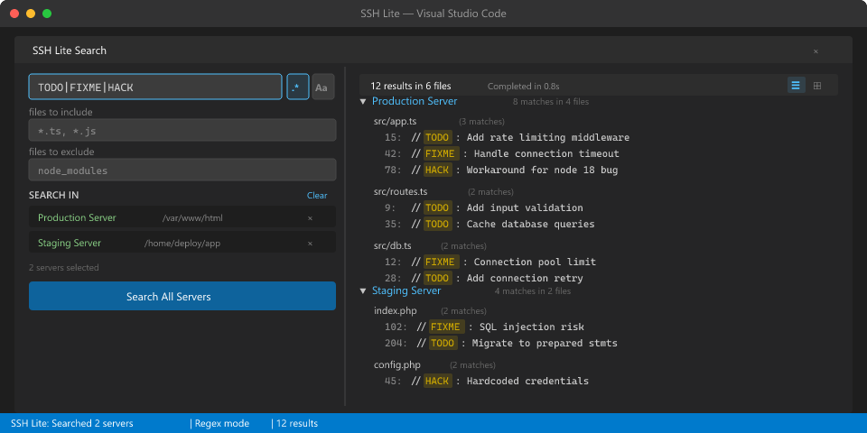
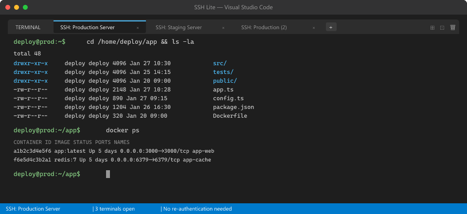
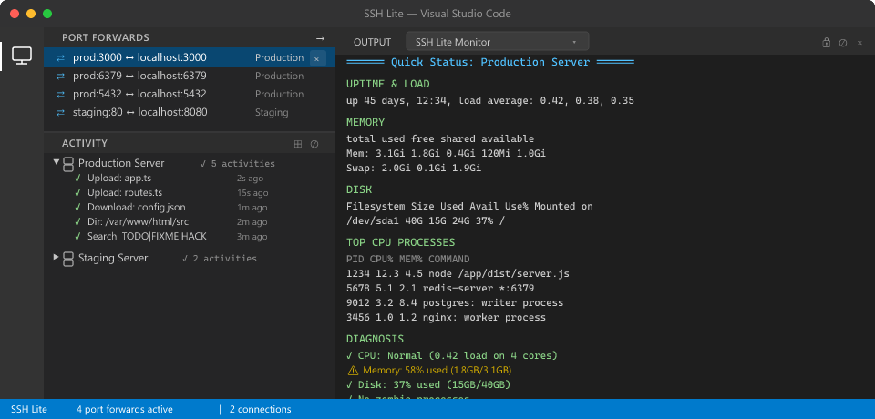

# SSH Lite (SSH Tools) — Lightweight SSH Suite for VS Code


> This extension is in active development. Please report any issues on [GitHub](https://github.com/trantung95/SSHLite/issues).

**The ultimate lightweight SSH extension for Visual Studio Code!** Connect to remote servers, browse files, open terminals, forward ports, manage processes and services, push SSH keys, run snippets and batch commands — all **without installing anything on the remote server**. Perfect for small VMs, shared hosting, and resource-constrained environments.



## Why SSH Lite?

Unlike VS Code's official Remote-SSH extension that installs a heavy VS Code Server on your remote machine (consuming RAM, CPU, and disk space), **SSH Lite works entirely from your local VS Code**. No remote installation required!

| Feature | SSH Lite | Remote-SSH |
|---------|----------|------------|
| Remote server installation | **None** | ~200MB+ |
| Works on shared hosting | **Yes** | No |
| Works on tiny VMs (512MB RAM) | **Yes** | Often fails |
| Multiple simultaneous connections | **Yes** | Limited |
| Server resource usage | **Zero** | High |

## Features

### Connect & Manage Hosts
Manage multiple SSH servers from the sidebar. Auto-detect SSH keys, save passwords, pin folders, and connect with one click. Reads `~/.ssh/config` automatically.



### Remote File Browser
Browse, edit, upload, and download files via SFTP. Upload state badges on editor tabs show sync status (✓ synced, ↑ uploading, ✗ failed). Filter files, right-click for full context menu.



### Search Across Servers
Search files across multiple remote servers simultaneously with regex, whole word, and case-sensitive matching. Include/exclude patterns (comma-separated), default exclusions matching VS Code, scoped search, and results grouped by server.



### Integrated SSH Terminals
Open multiple SSH terminals per connection — no re-authentication needed. Full terminal emulation with VS Code integration.



### Port Forwarding & Server Monitor
Forward remote ports to localhost. Monitor server health with CPU, memory, disk, top processes, and diagnostics — all from the Output panel.



### SSH Tools Utilities (v0.7.0+)

A growing suite of remote admin tools — all user-triggered, no background polling:

- **Remote Copy / Paste** — Copy or cut files/folders within a server or across servers. `Ctrl+C` / `Ctrl+X` / `Ctrl+V` in the file explorer. Auto-renames on conflict (`file (copy).txt`)
- **Process Viewer** — List processes by CPU, pick one, kill it (with optional sudo)
- **Service Manager** — List systemd services, start / stop / restart with one click
- **Environment Inspector** — View `env | sort` output as a read-only document
- **Cron Editor** — Read and write crontabs on the remote server
- **Snippet Library** — Save frequently used SSH commands, run with one click. Ships with 6 built-ins (disk usage, top CPU, top memory, listening ports, kernel, uptime)
- **Batch Runner** — Run the same command on multiple connected hosts simultaneously
- **Remote Script Runner** — Upload a local `.sh` / `.py` file and execute it on the remote
- **SSH Key Manager** — Generate ed25519 / RSA keypairs locally and push the public key to a remote `authorized_keys` in one step
- **Remote Diff** — Compare any remote file against a local file using VS Code's built-in diff editor

### All Features

**Core**
- Remote File Browser — Browse, edit, upload, download files via SFTP
- Integrated Terminal — Multiple SSH terminals per connection
- Port Forwarding — Forward local ports to remote services
- File Transfer — Upload/download files and folders
- Remote Copy / Paste — Copy or move files same-host or cross-host

**Smart**
- Auto-Save Credentials — Enter password once, auto-saved for next time
- SSH Config Support — Reads from `~/.ssh/config` automatically
- Multiple Connections — Connect to multiple servers simultaneously
- Auto-Reconnect — Automatic reconnection on unexpected disconnect
- Live File Refresh — Auto-refresh opened files from remote server
- Upload State Badges — Tab badge shows upload progress (↑) and failures (✗)
- File Search — Search across remote files with webview panel
- Filename Filter — Filter file tree with highlighting
- Activity Panel — Track all file operations in real-time
- Server Monitoring — Quick status, diagnose slowness, check services
- Large File Handling — Smart handling for files >100MB

**SSH Tools (Admin Utilities)**
- Process Viewer + Kill — `ps` list with one-click kill
- Service Manager — systemd start / stop / restart
- Env Inspector — read-only `env | sort` virtual document
- Cron Editor — read and write remote crontabs
- Snippet Library — saved commands, 6 built-ins + your own
- Batch Runner — run a command on all connected hosts at once
- SSH Key Manager — generate + push public keys
- Remote Script Runner — upload and exec local scripts
- Remote Diff — VS Code diff editor against any remote file

**Simple & Fast**
- One-click connect — Just click a host to connect
- No configuration needed — Works out of the box
- Minimal prompts — Credentials auto-saved, no extra questions

## Quick Start

### 1. Install Extension
Search "SSH Lite" in VS Code Extensions or install from command line:
```bash
code --install-extension hybr8.ssh-lite
```

### 2. Add a Host
- Click the **+** icon in SSH Lite sidebar
- Enter hostname, username, port
- Done!

### 3. Connect
- Click any host to connect
- Enter password (saved automatically for next time)
- Browse files, open terminals, forward ports

## Usage

### Connect to Server
1. Open SSH Lite in the Activity Bar (sidebar)
2. Click on any host to connect
3. First time: enter password → auto-saved for next time
4. Next time: instant connection!

### Browse & Edit Files
- Click on "Remote Files" panel after connecting
- Double-click files to open and edit
- Changes auto-upload on save
- Right-click for download, upload, delete options

### Open Terminal
- Right-click connected host → "Open Terminal"
- Or click the terminal icon on connected hosts
- Open multiple terminals on same connection (no re-auth!)

### Port Forwarding
- Open "Port Forwards" panel
- Click **+** to add new forward
- Enter local port, remote host, remote port
- Access remote services on localhost!

### Monitor Server
- Right-click connected host → Monitor icon
- **Quick Status** - CPU, memory, disk, top processes
- **Diagnose Slowness** - Find why server is slow
- **Watch** - Real-time monitoring
- **Check Services** - View service status
- **Recent Logs** - View system logs

## Configuration

All settings are in VS Code Settings under "SSH Lite":

| Setting | Default | Description |
|---------|---------|-------------|
| `sshLite.hosts` | `[]` | Saved SSH hosts |
| `sshLite.sshConfigPath` | `""` | Custom SSH config path |
| `sshLite.defaultRemotePath` | `~` | Default path when connecting |
| `sshLite.autoUploadOnSave` | `true` | Auto-upload files on save |
| `sshLite.connectionTimeout` | `10000` | Connection timeout (ms) |
| `sshLite.keepaliveInterval` | `30000` | Keepalive interval (ms) |
| `sshLite.treeRefreshIntervalSeconds` | `0` | Auto-refresh file tree (0=disabled) |
| `sshLite.fileRefreshIntervalSeconds` | `0` | Auto-refresh opened files (0=disabled) |
| `sshLite.largeFileSizeThreshold` | `104857600` | Large file threshold (100MB) |

## Commands

> **Full reference:** [docs/COMMANDS.md](https://github.com/trantung95/SSHLite/blob/main/docs/COMMANDS.md) — all 98 commands with keybindings and menu locations.

### Keyboard Shortcuts

| Key | Action |
|-----|--------|
| `Ctrl+Shift+C` | Connect to host |
| `Ctrl+Shift+T` | Open terminal |
| `Ctrl+Shift+R` | Refresh files |
| `Ctrl+Shift+G` | Go to path |
| `Ctrl+Shift+F` | Filter files |
| `Ctrl+Shift+S` | Open search |
| `F2` | Rename file/folder |
| `Ctrl+C` | Copy remote item (file explorer focused) |
| `Ctrl+X` | Cut remote item |
| `Ctrl+V` | Paste remote item |

### Right-click Context Menu — File Explorer

| Action | When |
|--------|------|
| Open / Download / Upload | File or folder |
| Copy · Cut · Paste | File or folder (Paste shown only when clipboard has content) |
| Diff with Local File | File only |
| Delete · Rename · Move | File or folder |

### Right-click Context Menu — SSH Hosts panel

| Action | When |
|--------|------|
| Connect / Disconnect | Any host |
| Open Terminal · Monitor Server | Connected host |
| Show Remote Processes | Connected host |
| Manage Remote Service | Connected host |
| Show Remote Environment | Connected host |
| Edit Remote Crontab | Connected host |
| Run Snippet | Connected host |
| Run Local Script on Remote | Connected host |
| Push Public Key to Host | Connected host |

### Command Palette (`Ctrl+Shift+P`)

All 98 commands are available. Key ones to know:

| Command | Description |
|---------|-------------|
| `SSH Lite: Add SSH Host` | Add a new host |
| `SSH Lite: Add Snippet` | Save a new SSH command snippet |
| `SSH Lite: Manage Snippets` | Rename, edit, or delete your snippets |
| `SSH Lite: Batch Command on Hosts` | Run one command on multiple servers |
| `SSH Lite: Generate SSH Key` | Create an ed25519 / RSA keypair locally |
| `SSH Lite: Save Remote Crontab` | Write edited crontab back to the server |
| `SSH Lite: Clear SSH Clipboard` | Empty the remote copy/paste clipboard |
| `SSH Lite: Show Audit Log` | View file operation history |
| `SSH Lite: Quick Status` | CPU · memory · disk snapshot |
| `SSH Lite: Diagnose Slowness` | Find what's making the server slow |

## Requirements

- **VS Code** 1.85.0 or higher
- **SSH access** to your remote server (password or SSH key)
- No remote server requirements!

## Supported Authentication

- SSH Keys (RSA, Ed25519, ECDSA)
- Encrypted SSH keys (with passphrase)
- SSH Agent
- Password authentication
- SSH config file (`~/.ssh/config`)

## Troubleshooting

### Connection Timeout
- Increase `sshLite.connectionTimeout` in settings
- Check firewall allows SSH (port 22)

### Authentication Failed
- Verify username and password/key
- Clear saved credentials: Right-click host → "Clear Saved Credentials"
- Check SSH key permissions (should be 600)

### File Operations Slow
- Normal for large files over slow networks
- Use "Download to disk" option for very large files

## Known Issues

None at this time. Please report issues on GitHub.

## Contributing

Contributions welcome! Please submit Pull Requests on GitHub.

## License

Apache-2.0 License

## Release Notes

### 0.7.2 — SSH channel semaphore

- Per-connection channel semaphore prevents terminal opens from failing when parallel content search is running
- Terminal open shows "Waiting for a free channel..." progress notification and opens automatically when a slot frees up
- Terminal times out after 30s with a clear error if all channels remain busy
- Search automatically reduces concurrency on channel-limit failures and retries transparently (up to 3 times)
- New setting: `sshLite.maxChannelsPerServer` (default 8) — adjustable for servers with non-standard `MaxSessions`

### 0.7.1 — Filter UX improvements

- Filter results always show the configured limit in the success message
- Long messages (e.g. filter results) now appear as a popup notification instead of truncating in the status bar
- When a filter hits its limit, a warning popup offers an **Increase Limit** option to update `sshLite.filterMaxResults` directly
- Hover tooltips on filtered folders and the deep-filter header now show the configured limit and flag when it was reached

### 0.7.0 — SSH Tools suite

- **9 new utilities**: process viewer + kill, service manager (start/stop/restart), environment inspector, cron editor, snippet library (6 built-ins + custom), batch command runner, remote script runner, SSH key manager (generate + push), remote diff editor
- **Snippet library**: ships with disk usage, top CPU, top memory, listening ports, kernel, and uptime built-ins. Add your own from the Command Palette
- **SSH Key Manager**: generates ed25519 / RSA keypairs locally via `ssh-keygen` and installs the public key to remote `~/.ssh/authorized_keys` in one step
- **Remote Diff**: compare any remote file against a local file using VS Code's built-in diff editor
- **Busybox compatibility**: Process viewer works on Alpine/busybox servers (no systemd required)

### 0.6.0 — SSH Tools rebrand + remote copy/paste

- **Renamed** to "SSH Lite (SSH Tools)" — positioning the extension as a growing SSH utility suite
- **Remote copy/paste**: right-click Copy/Cut on any file or folder, right-click Paste on a destination. Works same-host (`cp -r`) and cross-host (SFTP stream). `Ctrl+C` / `Ctrl+X` / `Ctrl+V` keybindings in the file explorer
- **Auto-rename on conflict**: pasting into a folder that already has the same filename produces `name (copy).ext`, `name (copy) 2.ext`, etc.
- Cancellable progress notification for large transfers

### 0.5.6 — PEM private key authentication via UI

- **Add User** now asks whether to authenticate with a password or a private key (PEM). The key path is validated and a passphrase is optional — leave it empty for keys with no passphrase. Fixes [#3](https://github.com/trantung95/SSHLite/issues/3)
- **First-time connect** no longer forces a password prompt when the host already has an Identity File (e.g. from `~/.ssh/config`) — it creates or reuses an SSH-key credential instead
- **"Re-enter Passphrase"** retry action on authentication failure for key-based credentials, mirroring the existing password-retry flow
- Internal: `CredentialService.addCredential` skips `SecretStorage` writes when the passphrase is empty so passwordless keys don't leave blank entries

### 0.5.4 — VS Code-style search enhancements

- **Whole word search**: New `Ab|` toggle button matches whole words only (grep `-w` flag). Works with both literal and regex modes
- **Comma-separated include patterns**: Enter `*.ts, *.js` in "files to include" to search multiple file types simultaneously
- **Default exclusions**: Auto-excludes `.git`, `node_modules`, `.svn`, `.hg`, `CVS`, `.DS_Store`, `bower_components`, `*.code-search` — matching VS Code's default search behavior. Controlled by `sshLite.searchUseDefaultExcludes` setting (default: on)

### 0.2.1 (Beta)
- **Comprehensive regression test suite** - 727 tests (30 suites) covering all features
- **Extracted extension helpers** - `parseHostInfoFromPath`, `isInSshTempDir`, `hasSshPrefix` as testable exports
- **Real API upload state tests** - Tests actual FileService `isFileUploading`/`isFileUploadFailed` public methods
- **Progressive download tests** - Full coverage for ProgressiveDownloadManager (threshold, state, cancel, cleanup)
- **Binary file detection tests** - `isLikelyBinary`, `parsePreviewUri`, `createPreviewUri` coverage
- **WriteFile timeout pattern tests** - Settled guard, double-settle prevention, callback race conditions
- **Drag-and-drop connection reorder** - Tests for sidebar connection drag/drop reorder algorithm
- **Orphaned file detection tests** - Tests real helper functions for startup SSH file detection

### 0.2.0 (Beta)
- **Upload state tracking** - Tab badges show upload progress (↑ yellow) and failures (✗ red) via FileDecorationProvider
- **Reliable file save** - Replaced SFTP stream with writeFile API for confirmed server-side writes (no more false failures)
- **Cross-platform path normalization** - Fixed Windows drive letter case mismatch between VS Code and OS APIs
- **Save notification fix** - Status bar correctly shows upload result instead of spinner
- **Activity panel** - Real-time tracking of all SSH operations
- **Multi-server grouping** - Hosts grouped by host:port in sidebar
- **Search auto-cancel** - Previous search cancelled when starting new one
- **Comprehensive test suite** - 674 tests (587 mock + 87 Docker e2e)

### 0.1.9 (Beta)
- Fix disconnect auto-reconnect behavior
- Fix sidebar icon issues
- Security hardening and LITE principles compliance

### 0.1.8 (Beta)
- Add Banh Mi Easter egg

### 0.1.7 (Beta)
- Auto-reconnect on unexpected connection drop
- Live file tracking and auto-refresh
- UX improvements

### 0.1.6 (Beta)
- Fix marketplace packaging issues

### 0.1.5 (Beta)
- Fix extension activation issue (commands not found)
- Fix view registration mismatch
- Include node_modules dependencies in VSIX
- Proper terminal icon for marketplace
- Allow password retry on authentication failure

### 0.1.2 (Beta)
- Search feature redesign with webview panel
- Filename filter with tree highlighting
- Smart refresh and real-time file watching
- Progressive download for large files
- UX enhancements: auto-dismiss notifications, keyboard shortcuts
- Improved preloading and caching

### 0.1.0
- Initial release
- Remote file browser with SFTP
- Integrated SSH terminals
- Port forwarding
- Auto-save credentials
- Server monitoring tools
- Audit trail logging
- Large file handling

---

## Keywords

ssh, sftp, remote, terminal, ssh client, remote file, file browser, ssh terminal, port forwarding, ssh tunnel, remote development, remote server, linux server, vps, virtual server, cloud server, aws ssh, azure ssh, gcp ssh, digitalocean, linode, vultr, ssh connection, ssh key, ssh password, ssh config, putty alternative, remote access, server management, devops, sysadmin, system administration, remote file editing, remote file browser, ssh file transfer, secure shell, openssh, remote terminal, ssh extension, vscode ssh, vs code ssh, visual studio code ssh, lightweight ssh, simple ssh, easy ssh, fast ssh, no install ssh, serverless ssh, agentless ssh, remote coding, remote editing, server monitoring, linux monitoring, server status, server diagnostics

---

**Enjoy simple, fast SSH access!**

---

<div align="center">

### 🥖 Send me a Bánh Mì

<sub>If this extension saved you time, you could send me a Vietnamese sandwich! 🇻🇳</sub>

**Crypto wallet**: *Coming soon* ☕

<sub>🪷 Made with cà phê sữa đá in Vietnam 🍜</sub>

</div>
